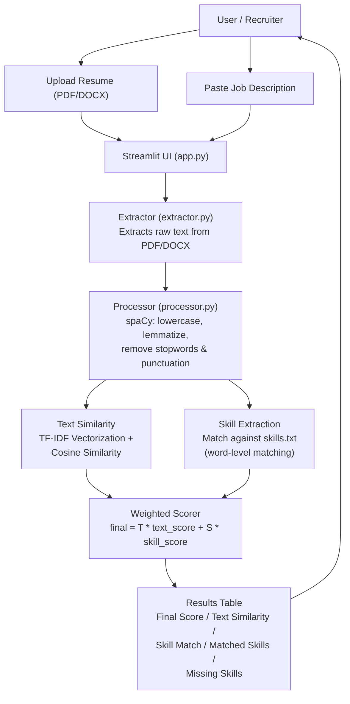
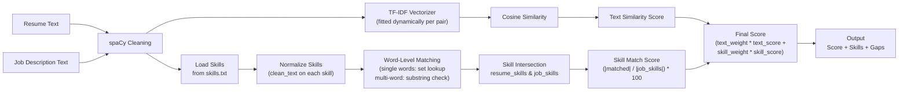

# Resume Matcher
### Intelligent Resume / Job Description Matching System


---

## System Architecture



---

## Matching Pipeline



---

## Project Overview

**Resume Matcher** is a production-style Machine Learning + NLP application that evaluates how well a candidate's resume aligns with a given job description.

It is designed as a real-world ATS (Applicant Tracking System) prototype, showcasing:
- Practical NLP techniques
- Clean software architecture
- End-to-end deployment

---

## Why This Project Matters

Recruiters often deal with:
- Hundreds of resumes per role
- Limited time for manual screening
- Subjective and inconsistent evaluation

This system automates the first screening layer by:
- Objectively comparing resumes with job requirements
- Highlighting relevant skills
- Producing transparent and explainable similarity scores

---

## Key Features

- Resume / Job Description similarity scoring
- Supports PDF and DOCX resumes
- Fully deployed Streamlit web application
- Dynamic TF-IDF vectorization at runtime
- Skill extraction using a curated dataset of 220+ skills
- Weighted scoring (text similarity + skill match)
- Per-resume error isolation (one failure does not block others)

---

## Technical Approach

### NLP & Machine Learning Strategy

1. Resume and job description text is:
   - Extracted from documents (pdfplumber / python-docx)
   - Cleaned and normalized via spaCy (lowercasing, lemmatization, stop-word removal)
2. Text is vectorized using TF-IDF
3. Similarity is calculated using Cosine Similarity
4. Skills are extracted via word-level matching against a curated keyword dataset
5. Final score = weighted combination of text similarity and skill match

No static or pre-trained model is stored. The TF-IDF vectorizer is trained dynamically for each comparison, ensuring flexibility and transparency.

### Why TF-IDF?

- Lightweight and fast
- Highly interpretable (important for ATS systems)
- Strong baseline for text similarity
- Easy to deploy and scale

---

## Application Screenshots

### Main Interface
Upload resumes and enter job descriptions through a clean, minimal UI.


### Matching Results & Skill Insights
Displays match score and extracted skills clearly and intuitively.


---

## Project Structure

```
resume-screening-ml/
|
+-- requirements.txt             Project dependencies
|
+-- resume_matcher/
|   +-- app.py                  Streamlit UI entry point
|   | 
|   +-- data/
|   |   +-- skills.txt          Curated skills dataset (220+ skills)
|   |   +-- __init__.py
|   | 
|   +-- src/
|       +-- extractor.py        PDF & DOCX text extraction
|       +-- processor.py        Text preprocessing (spaCy) + skill extraction
|       +-- matcher.py          TF-IDF, cosine similarity, weighted scoring
|       +-- __init__.py
|
+-- screenshots/
|   +-- image1                  UI screenshot
|   +-- image2                  Results screenshot
|
+-- test.py                     Functional tests
```

---

## Module Breakdown

### `app.py`
- Streamlit-based frontend
- Handles resume uploads and job description input
- Displays ranked results with match scores, matched skills, and missing skills
- Uses tempfile for secure temporary file handling
- Isolates per-file errors so one failure does not crash the batch

### `extractor.py`
- Extracts raw text from PDF (pdfplumber) and DOCX (python-docx) resumes
- Handles edge cases (empty files, unsupported formats)

### `processor.py`
- Cleans and normalizes text using spaCy
- Loads and matches skills from skills.txt
- Uses word-level matching for single-word skills to eliminate false positives

### `matcher.py`
- Builds TF-IDF vectors dynamically for each resume/JD pair
- Computes cosine similarity for text matching
- Computes skill intersection for skill gap analysis
- Produces a weighted final score

### `skills.txt`
- Keyword-based skills dataset with 220+ entries
- Covers programming languages, frameworks, databases, cloud, DevOps, data science, ML/AI, soft skills, compliance, and more

---

## Local Installation & Execution

### 1. Clone the Repository
```bash
git clone https://github.com/learnerforge/resume-screening-ml.git
cd resume-screening-ml
```

### 2. Install Dependencies
```bash
pip install -r requirements.txt
```

### 3. Run the Application
```bash
streamlit run resume_matcher/app.py
```

---

## Output Explanation

- **Final Score** -- Weighted combination of text similarity and skill match (configurable weights via sidebar slider)
- **Text Similarity** -- Cosine similarity between TF-IDF vectors of resume and job description
- **Skill Match** -- Percentage of required skills found in the resume
- **Matched Skills** -- Skills present in both resume and job description
- **Missing Skills** -- Skills required by the job but absent from the resume

---

## Use Cases

- Resume screening automation
- ATS-style matching demo
- NLP similarity engine
- ML / AI internship portfolio
- Deployed ML system showcase

---

## Future Enhancements

- Resume ranking against multiple job descriptions
- Semantic similarity using BERT / Sentence Transformers
- Resume improvement suggestions
- Cloud scaling and performance optimization
- Multi-language resume support

---

## Author

**Gugilla Aakash**  
Aspiring Machine Learning Engineer

GitHub: https://github.com/Gugilla-Aakash
